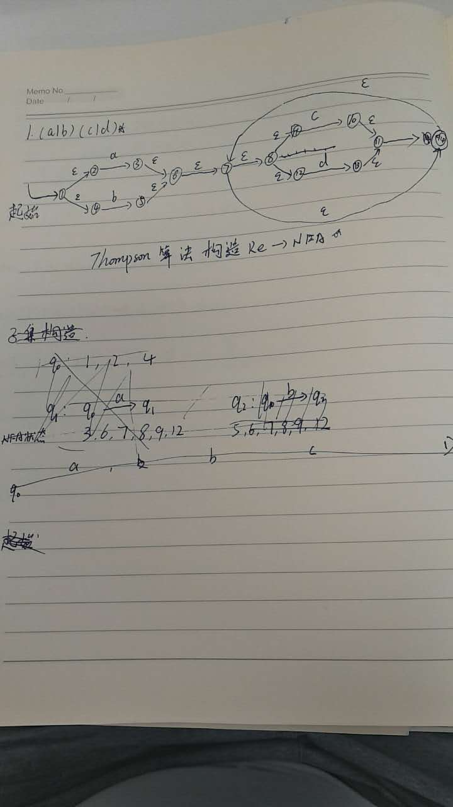
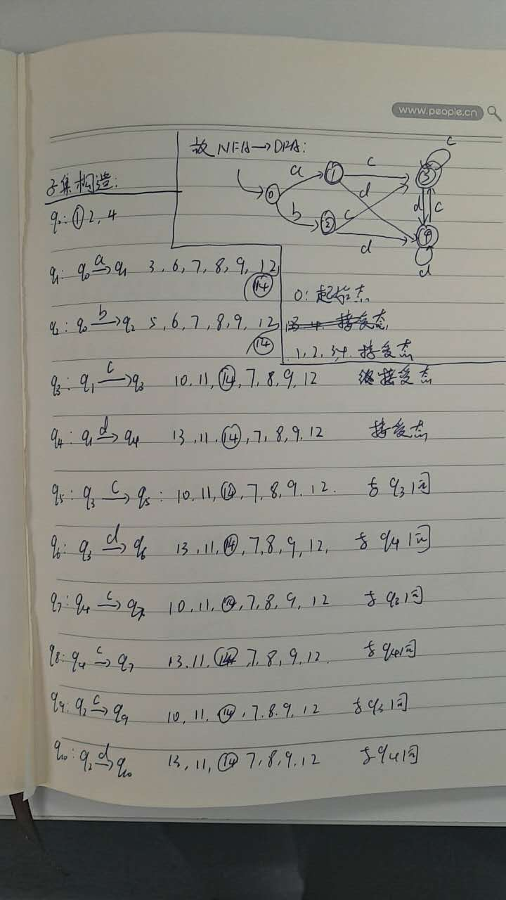
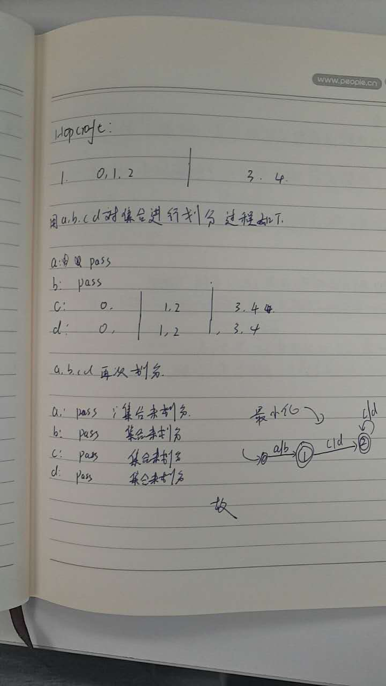
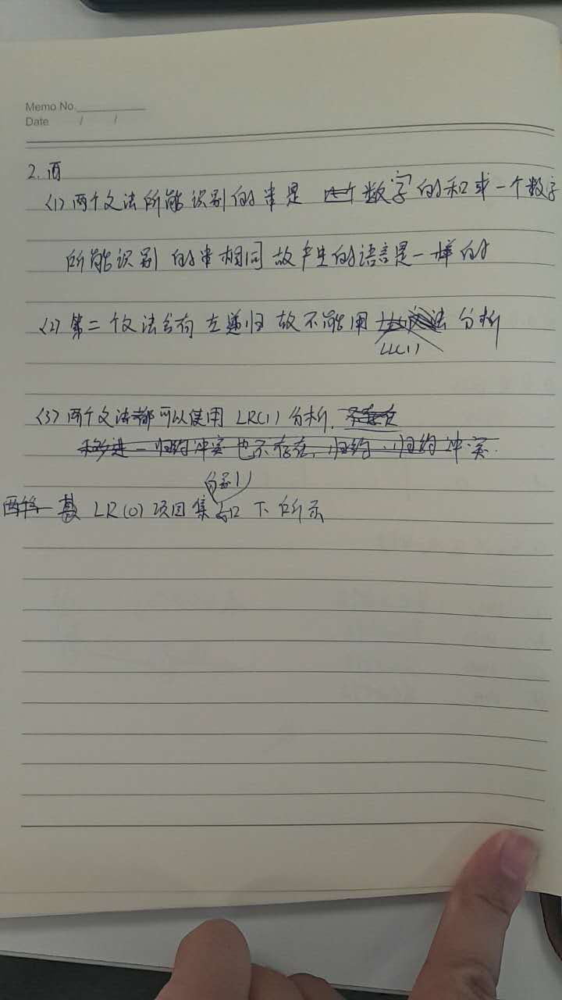
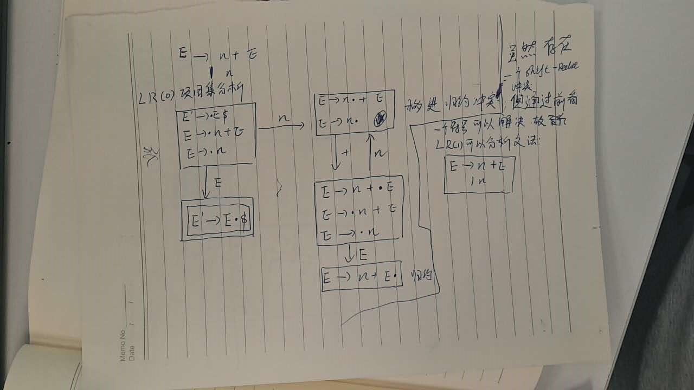
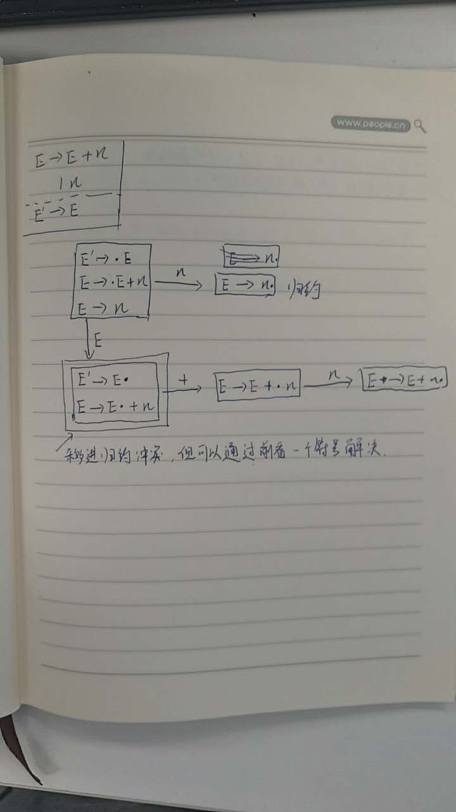
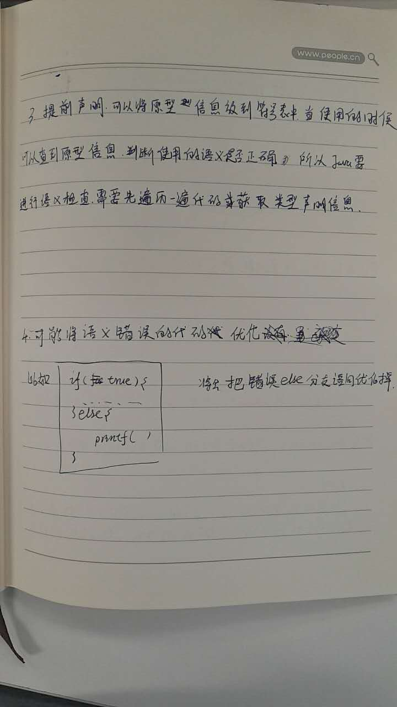
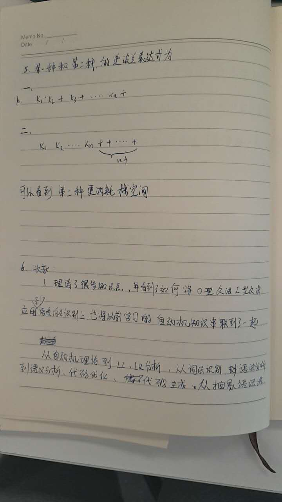
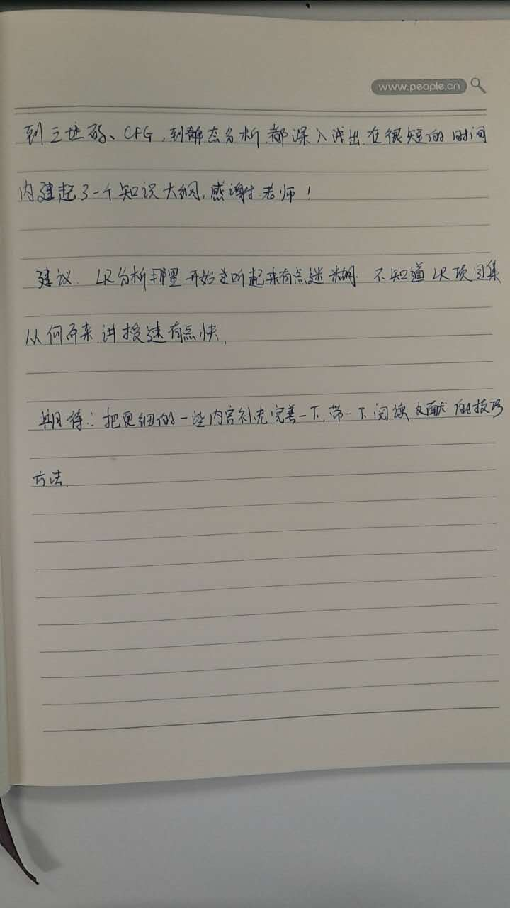

```
1. 给定如下的正则表达式

（a|b)(c|d)*

（1）使用Thompson算法将其转换成NFA；

（2）使用子集构造算法将NFA转换成DFA；

（3）使用Hopcroft算法将上述DFA最小化。


2. 对于下述的两个上下文无关文法：

（第一个文法）

E -> n + E

   | n

（第二个文法）

E -> E + n

   | n

问题：

    简要说明为什么上述两个文法产生的语言是一样的；

    哪个文法可以用LL(1)分析；为什么？

    哪个文法可以用LR(1)分析；为什么？

    用LR分析法，对这两个文法的分析效率哪个高？为什么？


3. 在C语言中，函数在使用前必须声明其原型；而在Java中，调用其它类中的方法不需要提前进行原型的声明。这两种不同的规定，对语义检查器有什么影响？


4. 在类型检查前就进行编译优化会有什么问题？请简单解释。

5. 考虑如下两种不同结合性的表达式：

（第一种）

((k1+k2)+...+kn-1)+kn

（第二种）

k1+(k2+...(kn-1 + kn))

对栈式计算机生成代码的话，哪种表达式会消耗更多的操作数栈的空间。简要解释你的结论。

6. 你学习本课程有何收获？对本课程有什么意见建议？对下轮授课有何期待？请提出你的建议。【任何答案，除非没有作答，都将得到满分。】

```




















